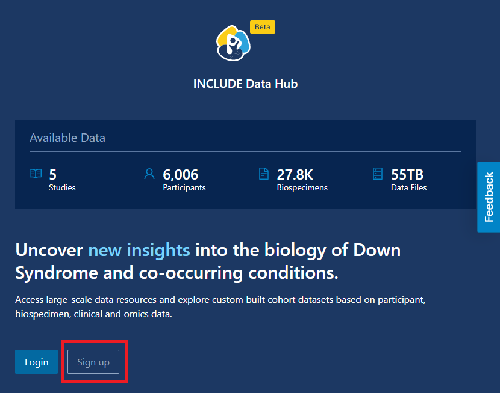

# INCLUDE Portal Registered Tier Data

## Access
To receive access to this dataset, you will need to sign up with INCLUDE and agree to the terms of use. [Visit the login page](https://portal.includedcc.org/login), and click sign up. You will need either a Google Account or an ORCID as your authentication method. [Here are instructions to create a Google Account](https://support.google.com/accounts/answer/27441?hl=en)- it can also be used for AnVIL on Terra.

 

## Data Resources

### Portal
The [INCLUDE DCC Portal](https://portal.includedcc.org/) UI may provide insight into the FHIR Resources.

### Data Source
All data in the INCLUDE Portal is currently in a Registered Tier of access. The original data source with RNASeq-derived transcript counts are sourced from the [Human Trisome Project](http://www.trisome.org/). 

### FHIR Service
API Requests can be made against the FHIR Base URL: https://include-api-fhir-service.includedcc.org/ 

### DRS Service
The file data in across INCLUDE is indexed by one of two DRS services: an INCLUDE specific service and the Kids First DRS server. The data for this project is currently in the Kids First service, which is stored underneath in AWS s3 buckets.

## Authentication
Once you have registered, you can access the data using cookie-based authentication.

### Within the browser
Your browser will manage the cookie to enable access transparently to you the user. You will need to login one time, then you will be able to make HTTP REST requests via the browser. Once the cookie expires or you log out, you'll need to log in again.

### Supplying the cookie for programmatic requests
To access the FHIR services via programmtic requests, eg using `curl`, you will need to pass along a cookie. Some methods to retrieve this cookie:
1. Visit the [FHIR Service](https://include-api-fhir-service.includedcc.org/) in your browser.
2. Login, if you have not already.
3. Using browser-specific tools, view cookies. 
- For Chrome, you can visit this settings URI: chrome://settings/cookies/detail?site=include-api-fhir-service.includedcc.org to view the specific cookies for the INCLUDE FHIR Service.
- While at the FHIR Service URL, you can also use the Chrome developer tools -> Application -> Storage -> Cookies.
- For Firefox, they can be found in the [Storage Inspector](https://firefox-source-docs.mozilla.org/devtools-user/storage_inspector/index.html).
4. Find `AWSELBAuthSessionCookie-0`, and copy the ENTIRE value. 
5. Configure your tool to use this cookie.
- The cookie's "key" is `AWSELBAuthSessionCookie-0` and the cookie's "value" is what you recorded previously.
- If your HTTP tool has a cookie specific option, you can add this key-value pair to the cookie list. EG:
- For `curl`, you can use `curl --cookie "AWSELBAuthSessionCookie-0=<your cookie here>"`
- If your HTTP tool does not have a cookie specific option, you'll need to add it to the headers, a la `header = { "Cookie": "AWSELBAuthSessionCookie-0=<the value you copied>" }`
- This is demonstrated in the [configuration](config/include.sh) and [test](tests/include_test.sh) bash scripts.
